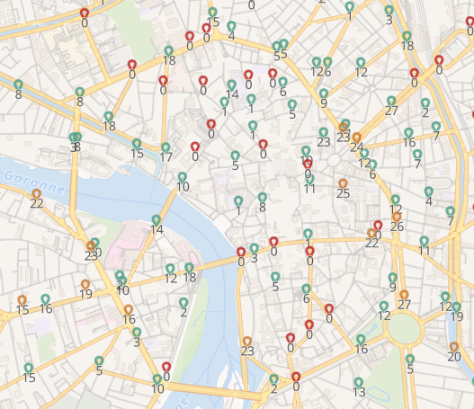
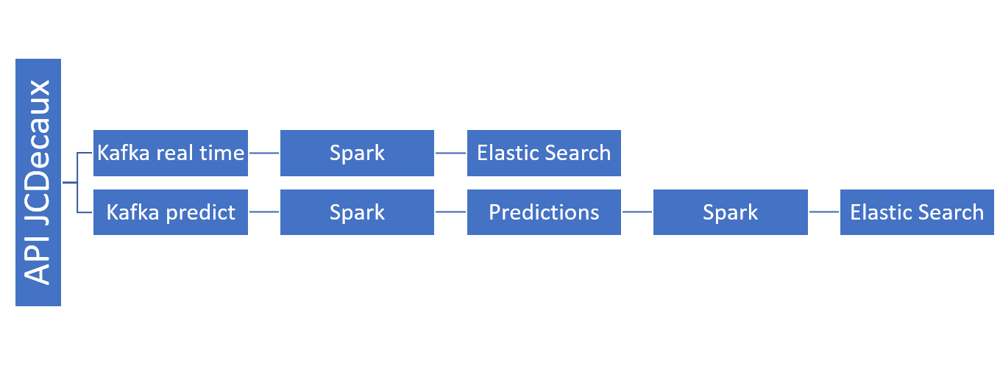
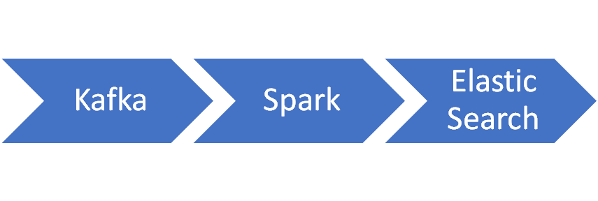
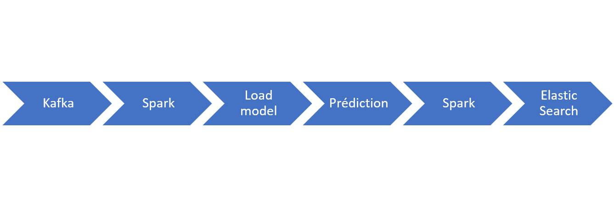
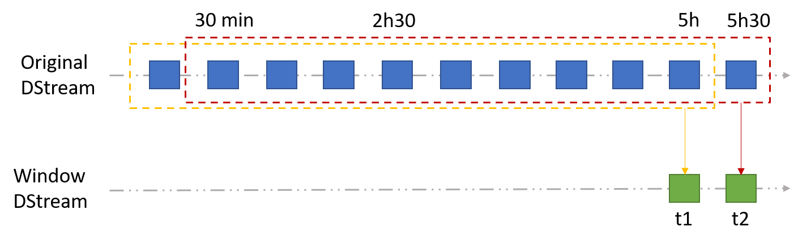
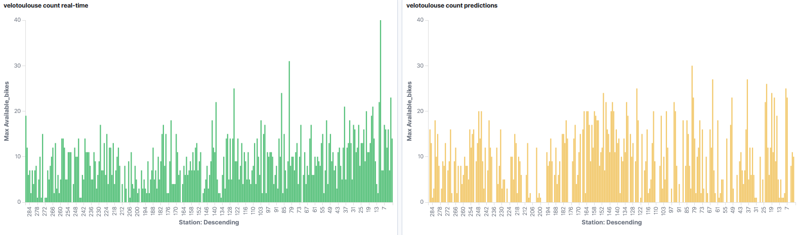

<div class="align-center" style="text-align: center; margin: auto;">


</div>

<br>
# VélôToulouse
---
### Objectifs
Le premier jectif de ce projet était de représenter, en temps réel, sur une carte, l'état des stations VélôToulouse en temps réel.
Le second objectif était de retranscrire sur une carte l'état des stations dans 30 minutes grâce à un model "time-series" crée
grâce à la librairie Python *statsmodel*.

<p align="center">
  
</p>

### Logiciels requis

Pour pouvoir utiliser ce projet, les installations de quelques logiciels sont nécessaires :
- Kafka
- Spark
- Hadoop
- Kibana X.X.X
- ElasticSearch X.X.X
- elasticsearch-hadoop-X.X.X.jar

Les "X" sont les numéros de version, ils doivent être similaires pour Kibana, ElasticSearch et le jar complémentaire qui permettra
d'envoyer nos données depuis Spark dans Elastic Search.

### Configuration des variables d'environnement

Après avoir installé les logiciels, il faut configurer quelques variables d'environnement dans le *~/.bashrc* :
- SPARK_HOME
- HADOOP_HOME
- PYTHONPATH
- PYSPARK_PYTHON

Une fois que ces variables sont correctement configurées, il faut installer les dépendances Python du projet. Pour cela,
il est fortement conseillé d'utiliser un environnement virtuel Python.
Vous pouvez installer automatiquement toutes les dépedances à l'aide de la commande :
```
pip install -r requirements.txt
```


Maintenant que les installations sont réalisées nous allons poursuivre en expliquant brièvement le projet.

### Architecture du projet

<p align="center">
  
</p>

Ce projet utilise l'API JCDecaux (https://developer.jcdecaux.com/#/home), il faudra que vous génériez une clé pour utiliser le projet.
Depuis cette API, nous utilisons deux producers Kafka différents :
- Le premier (*Kafka real time*) va récupérer des données toutes les minutes de l’API en JSON et filtrer ces données sur la ville de Toulouse.
- Le second (*Kafka predict*) va faire la même chose mais en s'actualisant toutes les 30 minutes.

Nous voyons donc que le projet est vraiment distingué en deux branches : une pour afficher en temps réel et une pour prédire. 
Cette architecture est répectée dans le code puisqu'il existe deux répertoire *real_time* et *predictions* qui contiennent 
les fichiers permettant "d'utiliser une branche" indépendamment de l'autre.

### Producers

Nous allons créer deux topics Kafka après avoir démarrer ZooKeeper et Kafka. Tapez alors ces deux commandes en vous
plaçant dans le répertoire de Kafka :
```
./bin/zookeeper-server-start.sh ./config/zookeeper.properties
./bin/kafka-server-start.sh ./config/server.properties
```

Une fois que c'est fait, nous allons créer les topics pour récupérer les records des deux producers Kafka :
```
./bin/kafka-topics.sh --create --zookeeper localhost:2181 --replication-factor 1 --partitions 1 --topic velib
./bin/kafka-topics.sh --create --zookeeper localhost:2181 --replication-factor 1 --partitions 1 --topic velopredict
```

Pour lancer ces les deux producers, vous pouvez taper les commandes suivantes (en supposant que vous êtes à la racine du projet 
et que vous utilisez notre clé API) :
```
python real_time/call_apy.py      # pour l'application en temps réel
python predictions/producer_predict.py      # pour l'application de prédiction
```

### Application en temps réel

<p align="center">
  
</p>

Maintenant que le producer est activé, nous allons utiliser l'application Spark Streaming pour pouvoir envoyer les données 
qui nous intéressent à travers un pySpark dataframe chaques minutes à Elastic Search. Nous pouvons le faire grâce à la commande 
suivante :
```
spark-submit --packages org.apache.spark:spark-streaming-kafka-0-8_2.11:2.4.4 --jars ../{PATH TO elasticsearch-hadoop-X.X.X.jar}
 --driver-class-path ../{PATH TO elasticsearch-hadoop-X.X.X.jar} real_time/kafka_to_es.py
```

Nous récupérons alors nos données dans Elastic Search à l'index : "*velotoulouse-geo*". Il est fortement conseillé d'utiliser 
l'extension *ElasticVue* d'ElasticSearch pour pouvoir visualiser les données. 

**Visulation**

Pour pouvoir visualiser dans Kibana, il faut tout d'abord créer un template en JSON pour pouvoir mapper la variable "Position" 
au type "geo-point" :
```
PUT _template/realtime_template
{
  "index_patterns": ["velotoulouse-geo"],
  "mappings": {
      "properties": {
        "Position": {
          "type": "geo_point"
        }
    }
  }
}
```

Le template va donc s'appliquer en créant l'index pattern "velotoulouse-geo" et vous devriez avoir la variable "Position" 
mappée au type "geo-point".


### Application de prédiction

<p align="center">
  
</p>
Les blocs de cette application sont détaillés plus bas.

**Window**

Une fois le producer *producer_predict.py* lancé, il faut lancer le fichier *kafka_to_df.py* qui va récupérer les données
fenétrées toutes les 5h à un interval de temps de 30 minutes (donc 10 échantillons par stations). La fenêtre créée grâce 
à Spark streaming a un pas de temps de 30 min.

<p align="center">
  
</p>

La fenêtre va alors récuperer ces 10 échantillons par stations pour les regrouper en pySpark dataFrame. Pour cela, effectuer
la commande :
```
spark-submit --packages org.apache.spark:spark-streaming-kafka-0-8_2.11:2.4.4 predictions/kafka_to_df.py
```

**Prediction**

Maintenant que la window est créée, nous allons pouvoir loader le model précédemment entraîné avec des données récoltées 
pendant deux semaines (rien ne vous empêche de réentraîner le model grâce au fichier *learning.py*). Ce model va retourner
la liste de la quantité de vélos disponibles par station dans 30 minutes. Cette liste ainsi que des informations complémentaires
comme le numéro de la station, la capacité de la station, la disponibilité de places dans la station et la position de cette
dernière sont regroupées dans un pySpark dataFrame et envoyées toutes les 30 minutes dans ElasticSearch. Toutes ces opérations
se font en laçant un seul fichier :
```
spark-submit --packages org.apache.spark:spark-streaming-kafka-0-8_2.11:2.4.4 --jars ../{PATH TO elasticsearch-hadoop-X.X.X.jar}
 --driver-class-path ../{PATH TO elasticsearch-hadoop-X.X.X.jar} predictions/prediction.py
```

**Visualisation**

Maintenant que les données sont envoyées toutes les 30 minutes dans ElasticSearch, nous avons à créer un template pour visualiser
les stations sur la carte proposée par Kibana. Nous avons à réecrire le JSON précédent en changeant l'index pattern par le nouvel 
index : "*velotoulouse-predictions*".

### Dashboard 

Nous avons créées nos propres dashboards contenant du *Kibana Query Langage* nous permettant de mieux visualiser les stations
qui sont pleines et vides. Nous vous proposons ces dashboards qui se raffraîchissent automatiquement toutes les minutes
dans le dossier "dashboards". Vous n'avez plus qu'à les importer dans Kibana et visualiser quel vélo vous pourrez prendre 
dans 30 minutes.
<br>
<br>

<p align="center">
  
</p>


